# DWIB Pipeline Analitik Data NYC Taxi

## Deskripsi Repo:

Dikerjakan sebagai UAS / Proyek Akhir ke2 DWIB

Oleh: Muhammad Ramdan Izzulmakin (551362)

- Ini adalah pembuatan datamart dengan data dari new york city taxi https://www.nyc.gov/site/tlc/about/tlc-trip-record-data.page.
- Pembuatan datamart menggunakan DBT (data build tools). Dijalankan dengan pipeline/scheduler Apache Airflow.
- Semua dijalankan didalam docker (Airflow, DBT, Mailhog untuk test email, visualization).

## Catatan
### Ada 3 README.md:
- file ini
- sourcecode/README.md
- sourcecode/dbt_nyc_taxi/README.md
### Projek berjalan di docker, cara setup ada di sourcecode/README.md
### Bila docker dijalankan, maka dapat membuka dashboard berikut:

- airflow dashboard http://127.0.0.1:8081
- mailhog http://127.0.0.1:8025
- dokumentasi model hasil DBT http://127.0.0.1:8083
- dashboard visualisasi http://127.0.0.1:8082


---


# 3.1 Apache Airflow

- ### 3 files python DAG: [sourcecode/dags](https://github.com/imakin/dbt-airflow/tree/main/sourcecode/dags)
  
  - sourcecode/dags/nyc_taxi_ingestion.py
  - sourcecode/dags/nyc_taxi_transform.py
  - sourcecode/dags/nyc_taxi_monitor.py

- ### Docker compose: [sourcecode/docker-compose.yaml](https://github.com/imakin/dbt-airflow/tree/main/sourcecode/docker-compose.yaml), [sourcecode/Dockerfile](https://github.com/imakin/dbt-airflow/tree/main/sourcecode/Dockerfile)

- ### Screenshots
    - #### graph view
        - nyc_taxi_ingestion
        
        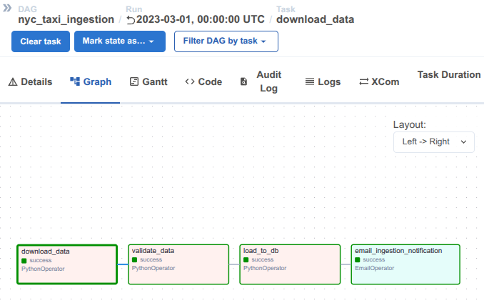

        - nyc_taxi_transform
        
        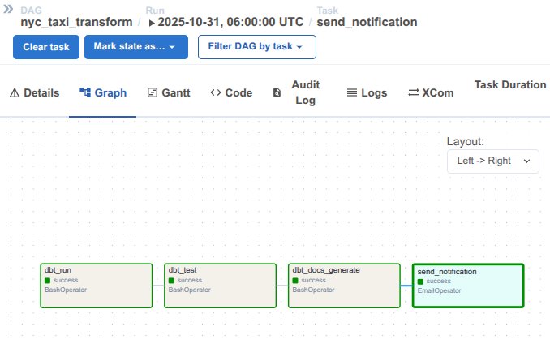

        - nyc_taxi_monitor
        
        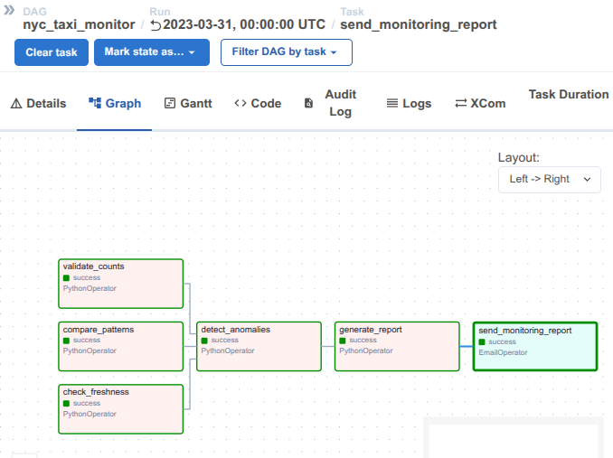


    - #### task runs

        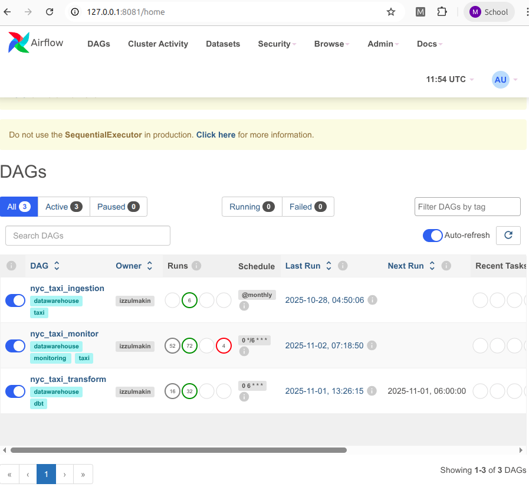

    - #### logs 

        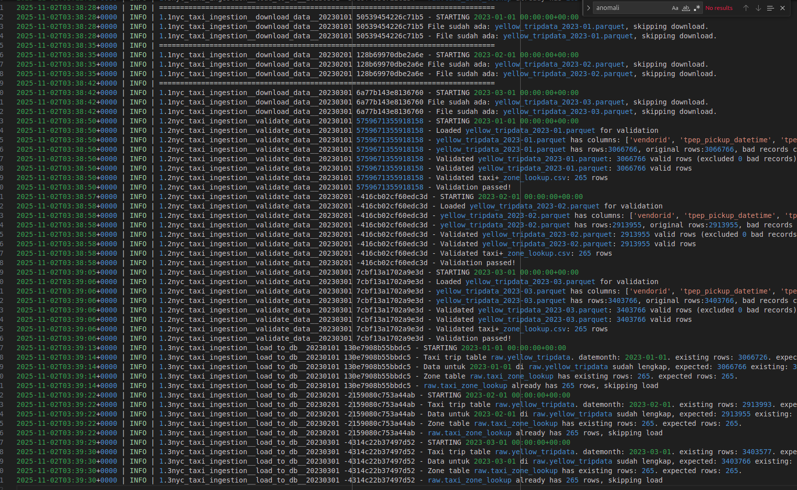

    - #### gantt chart

        - nyc_taxi_ingestion

        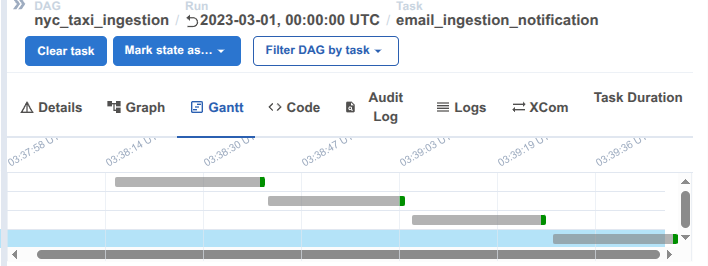

        - nyc_taxi_transform

        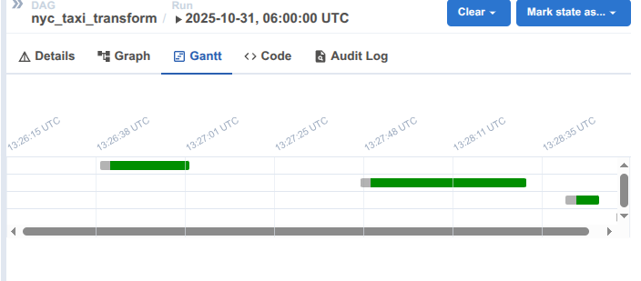

        - nyc_taxi_monitor

        
    
    - #### Notification/email

        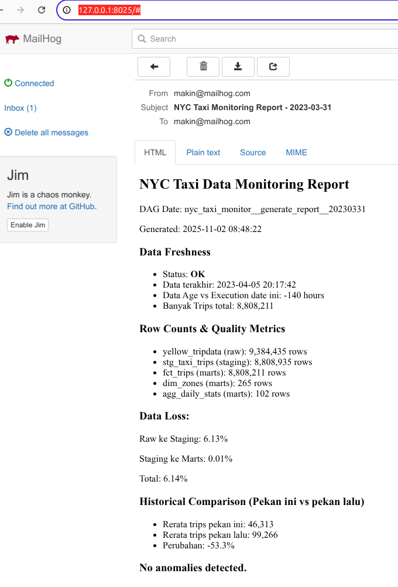


- ### Readme setup dapat dibaca di: [sourcecode/README.md](https://github.com/imakin/dbt-airflow/tree/main/sourcecode/README.md). Kode markdown: 
  
        ## Intro
        semua proses berjalan di dalam docker.
        sudah ada service untuk

        - airflow dashboard http://127.0.0.1:8081
        - mailhog http://127.0.0.1:8025
        - dokumentasi model hasil DBT http://127.0.0.1:8083
        - dashboard visualisasi http:127.0.0.1:8082

        Secara default email dikirim ke mailhog, bila ingin pakai smtp google bisa atur
        di `.env`

        ## prerequisite
        Sudah install docker terbaru (sudah support docker compose)
        kosongkan port 8081, 8082, 8083, 8025, 1025, atau atur di `.env` atau `docker-compose.yaml` untuk pakai port lain

        ## how to run
        1. buka terminal (bash/zsh/cmd/ps dll) masuk ke folder sourcecode
        2. buat file `sourcecode/.env` untuk override pengaturan lewat environment variable  contoh

                # sourcecode/.env

                # supaya file2 milik bersama dengan host
                # id -g
                AIRFLOW_GUID=1000

                # python -c 'import secrets; print(secrets.token_urlsafe(32))'
                AIRFLOW__WEBSERVER__SECRET_KEY=Dul583vYiwkuKoP1qInVbk5Dq7z43jw7JUpYQHA5PgM

                # python -c 'from cryptography.fernet import Fernet; print(Fernet.generate_key().decode())'
                AIRFLOW__CORE__FERNET_KEY=es7vdIxpLvYnezIlRVF3h4lcOck0cwGVzvQDaXzILNc=

                AIRFLOW_WEB_PORT=8081

                #user dan password untuk dashboard web
                AIRFLOW_WEB_USER=makin
                AIRFLOW_WEB_PASSWORD=makin

                DWIB_UAS_EMAIL_TO=you@mail.ugm.ac.id

                AIRFLOW__SMTP__SMTP_HOST=dwib-uas-mailhog
                AIRFLOW__SMTP__SMTP_STARTTLS=False
                AIRFLOW__SMTP__SMTP_SSL=False
                AIRFLOW__SMTP__SMTP_USER=you@gmail.com
                AIRFLOW__SMTP__SMTP_PASSWORD=passwordsmtp
                AIRFLOW__SMTP__SMTP_PORT=485
                AIRFLOW__SMTP__SMTP_MAIL_FROM=from@gmail.com

        3. jalankan `docker compose build`
        4. jalankan `docker compose up -d`
        5. buka browser di 127.0.0.1:8081 untuk GUI admin page airflow
        6. buka browser di 127.0.0.1:8025 untuk GUI email mailhog
        7. **Simulate 2023-01:** simulasi pipeline tanggal 2023-01-01 hingga 2023-03-31 dengan script yang sudah ada `simulate.sh` (might take long)

            - `docker exec -it dwib-uas-scheduler bash`
            - `cd /opt/airflow`
            - `source simulate.sh`

        8. Bila pipeline sudah dijalankan, dapat mengakses dokumentasi model di 127.0.0.1:8083
        8. Bila pipeline sudah dijalankan, dapat mengakses Visualisasi Data di 127.0.0.1:8082


# 3.2 Data Build Tool

- ### Complete DBT project: [sourcecode/dbt_nyc_taxi](https://github.com/imakin/dbt-airflow/tree/main/sourcecode/dbt_nyc_taxi)

- ### Semua SQL models: [sourcecode/dbt_nyc_taxi/models](https://github.com/imakin/dbt-airflow/tree/main/sourcecode/dbt_nyc_taxi/models)
  
  - sourcecode/dbt_nyc_taxi/models/staging/stg_taxi_trips.sql
  - sourcecode/dbt_nyc_taxi/models/staging/stg_taxi_zones.sql
  - sourcecode/dbt_nyc_taxi/models/intermediate/int_daily_metrics.sql
  - sourcecode/dbt_nyc_taxi/models/intermediate/int_trips_enhanced.sql
  - sourcecode/dbt_nyc_taxi/models/marts/dim_zones.sql
  - sourcecode/dbt_nyc_taxi/models/marts/fct_trips.sql
  - sourcecode/dbt_nyc_taxi/models/marts/agg_daily_stats.sql

- ### Schema YAML dengan tests, dengan comment untuk documentation: [sourcecode/dbt_nyc_taxi/models](https://github.com/imakin/dbt-airflow/tree/main/sourcecode/dbt_nyc_taxi/models)
  
  - sourcecode/dbt_nyc_taxi/models/staging/schema.yml
  - sourcecode/dbt_nyc_taxi/models/intermediate/schema.yml
  - sourcecode/dbt_nyc_taxi/models/marts/schema.yml

- ### Documentation / Generated docs (HTML) tersedia di: [sourcecode/dbt_nyc_taxi/target](https://github.com/imakin/dbt-airflow/tree/main/sourcecode/dbt_nyc_taxi/target). Bila menjalankan docker, dapat diakses di http://127.0.0.1:8083

- ### Screenshots:

    - #### dbt runs (screenshot ketika dijalankan manual tanpa airflow)

        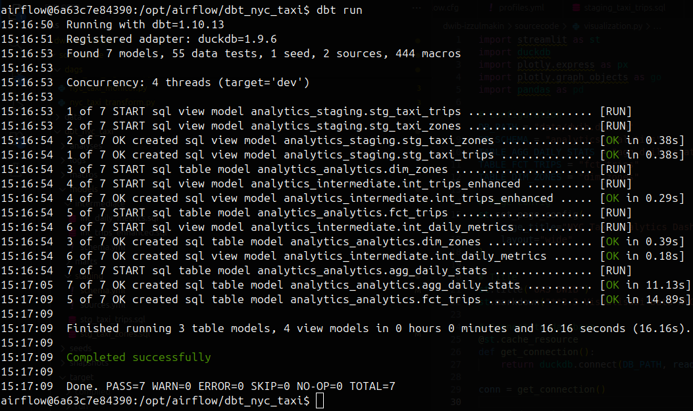

    - #### tests (screenshot ketika dijalankan manual tanpa airflow)

        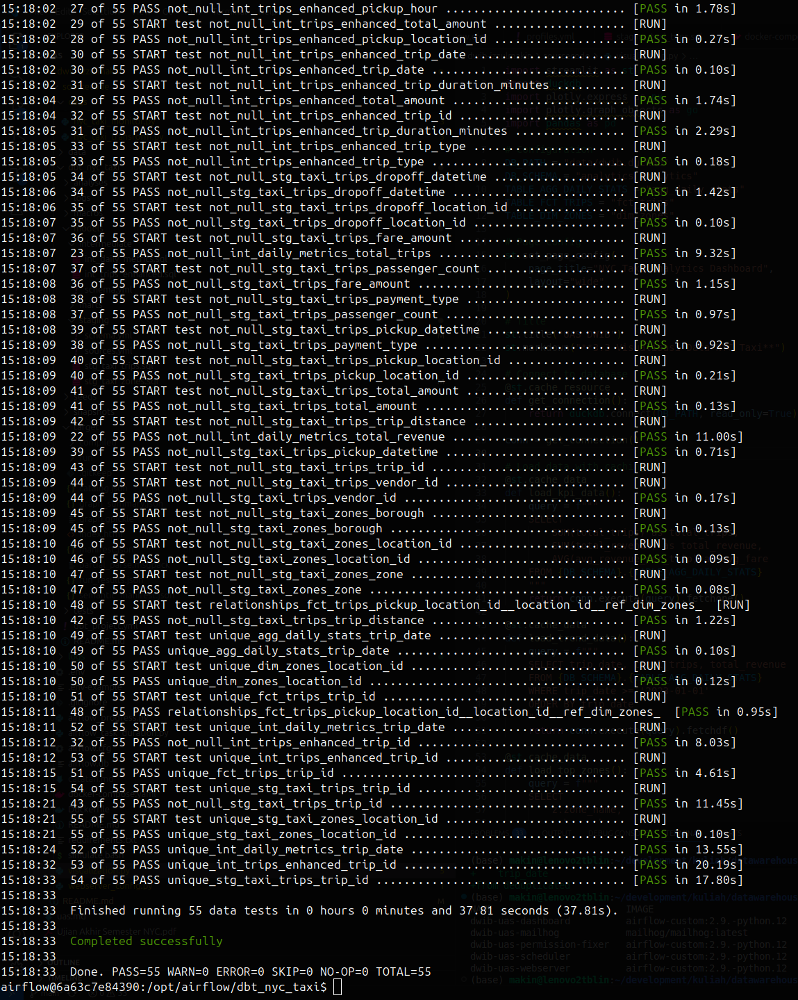

    - #### lineage graph

        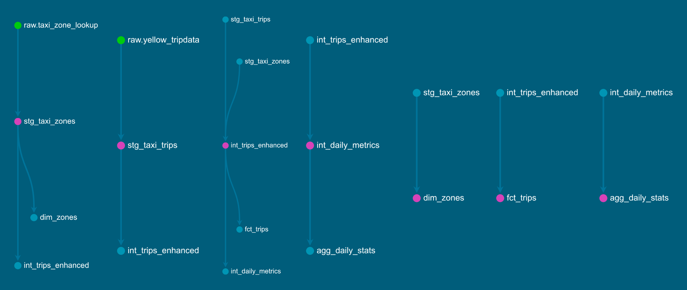

    - #### docs site

        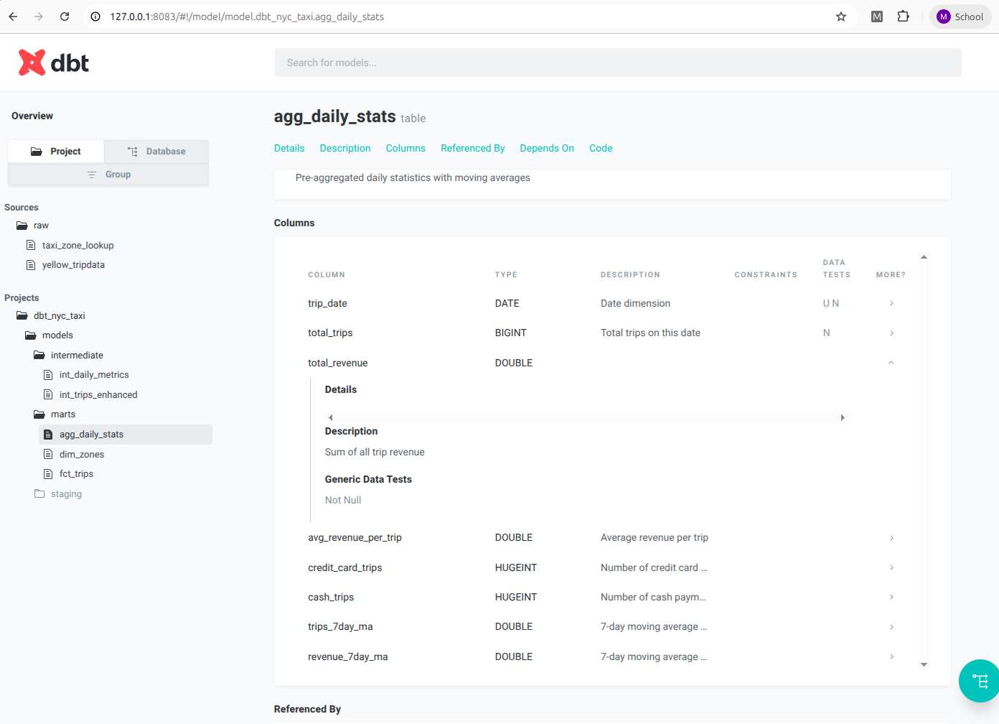


- ### README setup dibaca di: [sourcecode/dbt_nyc_taxi/README.md](https://github.com/imakin/dbt-airflow/tree/main/sourcecode/dbt_nyc_taxi/README.md). Kode markdown:
  
        # Deskripsi

        Baca dulu [sourcecode/README.md](https://github.com/imakin/dbt-airflow/tree/main/sourcecode/README.md)


        Folder project DBT ini sudah jadi dan akan di panggil di dalam task di apache airflow yang berjalan di project ini.
        Bila menggunakan docker (instruksi ../README.md) dbt akan terinstall di dalam docker.

        # Untuk mengakses dbt project ini di dalam docker

        buka terminal ke dalam docker (docker sudah jalan)
        ```
        docker exec -it dwib-uas-scheduler bash
        ```

        ```
        # di dalam docker
        cd /opt/airflow/dbt_nyc_taxi
        dbt run
        dbt test
        dbt docs generate
        ```
        Document server telah di forward dari docker ke host di port 8083 dengan `python -m http.server`,
        jadi bisa dibuka disitu http://127.0.0.1:8083 (tidak perlu jalankan `dbt docs serve`)

        # Bila ingin menjalankan manual tanpa airflow:

        1. Buat folder `.dbt`-nya di folder user bila belum ada, Kopi file `sourcecode/config/dbt/profiles.yml` ke:
        - Linux & MacOS: `~/.dbt/profiles.yml` (/home/namaakun/.dbt/)
        - Windows 11: `%USERPROFILE%\.dbt\profiles.yml` (C:/Users/NamaAkun/.dbt/profiles.yml)


        2. install requirements: **(NOTE: sesuaikan dengan posisi cwd terminal sekarang)** 

            ```
            # terminal host (bukan docker)
            # sesuaikan path terhadap working directory terminal sekarang
            cd sourcecode/dbt_nyc_taxi
            pip install -r ../requirements.txt
            ```

        3. jalankan dbt

            ```
            dbt run
            dbt test
            dbt docs generate
            # untuk serve sourcecode/dbt_nyc_taxi/target ke local server
            dbt docs serve
            ```

# 3.3 Visualisasi Data:

### Visualisasi dapat dibuka di http://127.0.0.1:8082 (bila docker dijalankan dan task pembuatan datamart sudah dijalankan)
### screenshot visualisasi

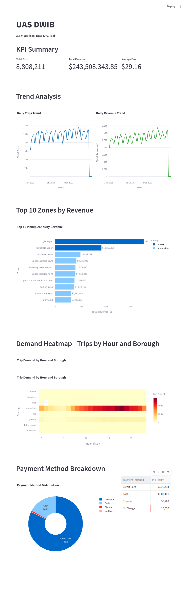

# 4. Video ada di folder video-presentation/

# 5. Tentang repo ini

- ### Repo ini berisi semua code files (folder sourcecode/),
- ### Sudah ada README.md dengan setup instructions (sourcecode/README.md dan sourecode/dbt_nyc_taxi/README.md)
- ### repo ini berisi sourcecode/requirements.txt (dijalankan otomatis oleh pip install didalam docker ketika docker build)
- ### repo ini berisi folder screenshots didalam screenshots/
- ### repo ini berisi dokumentasi model data di sourcecode/dbt_nyc_taxi/target (http://127.0.0.1:8083)
